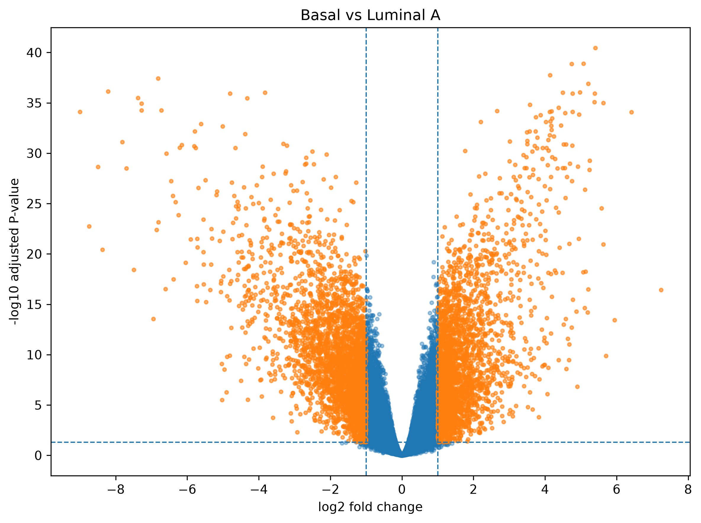

# Stage 2 — Differential Expression & Probe Annotation

## Research Question

Which genes and transcriptional features distinguish the major molecular subtypes of breast cancer, with particular emphasis on the basal-like phenotype compared with Luminal A, Luminal B, and HER2-enriched tumors?

## Methods

* Analyzed the GSE45827 breast cancer expression dataset containing 130 tumor samples across four molecular subtypes: Basal (n=41), HER2 (n=30), Luminal A (n=29), and Luminal B (n=30).
* Applied a low-variance filter, retaining 28,086 of 29,873 Affymetrix probes for differential-expression analysis.
* Used the limma empirical-Bayes framework to perform six pairwise subtype comparisons.
* Controlled for multiple testing using the Benjamini–Hochberg false-discovery rate (FDR).
* Annotated Affymetrix probes using `hgu133plus2.db`, retaining multiple valid gene mappings rather than arbitrarily selecting a single annotation.

## Findings

Differential expression was extensive across breast cancer subtypes. The strongest signal was observed between Basal and Luminal A tumors, with 16,959 probes reaching FDR < 0.05 and 5,969 meeting both FDR < 0.05 and |log2FC| ≥ 1.



The volcano plots demonstrate substantial transcriptional separation between the molecular subtypes. The direction of effect was biologically coherent; for example, ESR1 showed substantially lower expression in Basal relative to Luminal A tumors, consistent with the expected hormone-receptor-associated biology of luminal disease.

## Significance

Breast cancer is transcriptionally heterogeneous, and molecular subtype captures major differences in tumor biology and therapeutic vulnerability. Characterizing subtype-associated transcriptional programs provides a foundation for identifying biological pathways associated with the basal-like phenotype and, later, investigating immune biology and potential determinants of treatment response.

Importantly, the present analysis identifies transcriptional differences rather than establishing causal mechanisms or treatment-response biomarkers.

---

# Analysis details

The three primary comparisons were:

* Basal vs Luminal A
* Basal vs Luminal B
* Basal vs HER2

Three additional pairwise comparisons were performed to characterize the broader subtype structure:

* Luminal B vs Luminal A
* HER2 vs Luminal A
* HER2 vs Luminal B

Here, "Basal" refers to the molecular subtype defined in the source dataset. It should not be treated as synonymous with clinically confirmed triple-negative breast cancer (TNBC) in the absence of corresponding clinical receptor-status information.

## 2. Dataset

The analysis uses GEO accession **GSE45827**, an Affymetrix Human Genome U133 Plus 2.0 expression dataset containing breast cancer molecular subtypes.

The tumor cohort analyzed here contains:

| Molecular subtype | Samples |
| ----------------- | ------: |
| Basal             |      41 |
| HER2              |      30 |
| Luminal A         |      29 |
| Luminal B         |      30 |
| **Total**         | **130** |

The dataset also contains other sample types in the original study; these were not included in the tumor subtype differential-expression analysis.

## 3. Expression preprocessing

The expression matrix contained:

* 29,873 Affymetrix probes
* 130 tumor samples
* no missing expression values
* unique sample and probe identifiers

A variance filter of:

```text
variance > 0.1
```

was applied before differential-expression analysis.

This retained:

```text
28,086 probes
```

and removed 1,787 low-variance probes.

The expression values were already on an approximately log-scale, so no additional log transformation was applied.

## 4. Statistical model

Differential expression was performed using the Bioconductor `limma` package.

A no-intercept design matrix was used:

```text
~ 0 + subtype
```

with four subtype coefficients:

```text
Luminal A
Luminal B
HER2
Basal
```

Pairwise contrasts were then constructed between these coefficients.

The six contrasts were:

```text
Basal - Luminal A
Luminal B - Luminal A
HER2 - Luminal A
Basal - Luminal B
HER2 - Luminal B
Basal - HER2
```

Positive log2 fold-change therefore indicates higher expression in the first subtype named in the contrast.

## 5. Multiple-testing correction

For each contrast, limma's moderated t-statistics were calculated using empirical-Bayes variance moderation.

P-values were adjusted using the Benjamini–Hochberg procedure.

Two significance criteria were used:

```text
FDR < 0.05
```

and the more stringent combined criterion:

```text
FDR < 0.05
|log2FC| >= 1
```

The latter was used to identify genes showing both statistical evidence and a minimum effect
